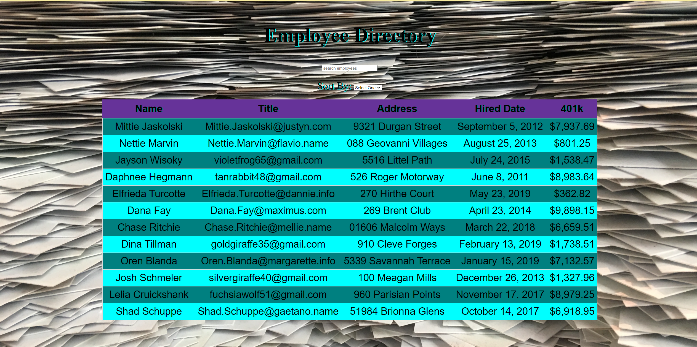

# React Employee Directory
 

### Description
This Employee Directory was created using React. The Employee Directory allows the user to filter using a search bar through the names of the employees, as well as sort alphabetically. 

## Credits

A link to the [React Employee Directory](https://nikolaslenning.github.io/React-Employee-Directory/) application is deployed on GitHub Pages. 

A link to the [React Employee Directory](https://github.com/nikolaslenning/React-Employee-Directory) repository is hosted on Github.

This application was authored by [Nikolas Lenning](https://github.com/nikolaslenning).

